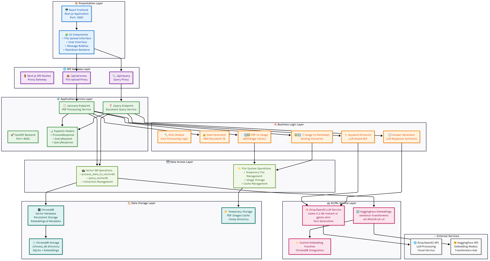

# ChatWithPDF 📄💬

A modern AI-powered application that enables users to upload PDF documents and have interactive conversations with them. Built with cutting-edge technology stack including Next.js, FastAPI, ChromaDB, and OpenAI.

## 🚀 Features

- **PDF Upload & Processing**: Drag-and-drop PDF upload with automatic processing
- **AI-Powered Chat**: Interactive chat interface to query PDF content
- **Intelligent Document Understanding**: Converts PDFs to images and extracts markdown content using AI
- **Vector Database**: Efficient semantic search using ChromaDB for fast retrieval
- **Modern UI**: Clean, responsive interface built with Next.js and Tailwind CSS
- **Real-time Processing**: Live updates during PDF processing and querying
- **Docker Support**: Easy deployment with Docker and GPU acceleration
- **API-First Design**: RESTful API for easy integration

## 🏗️ Architecture



The application follows a microservices architecture with:
- **Frontend Layer**: Next.js React application with TypeScript
- **API Gateway**: Next.js API routes acting as proxy
- **Backend Services**: FastAPI with Python for core processing
- **AI/ML Services**: Integration with OpenAI GPT-4 and HuggingFace embeddings
- **Vector Database**: ChromaDB for efficient document storage and retrieval
- **File Processing**: PDF to image conversion and markdown extraction

## 🎥 Demo Video


*Watch ChatWithPDF in action! 🚀*

## 🛠️ Technology Stack

### Frontend
- **Next.js 15.x** - React framework with App Router
- **TypeScript** - Type-safe JavaScript
- **Tailwind CSS** - Utility-first CSS framework
- **React Hooks** - Modern React patterns

### Backend
- **FastAPI** - Modern Python web framework
- **Python 3.8+** - Core backend language
- **ChromaDB** - Vector database for embeddings
- **Docker** - Containerization

### AI/ML
- **OpenAI GPT-4** - Large language model for responses
- **HuggingFace Transformers** - Sentence embeddings
- **Docling** - Document processing and conversion
- **PDF2Image** - PDF to image conversion

### Additional Tools
- **Uvicorn** - ASGI server
- **Pydantic** - Data validation
- **python-dotenv** - Environment variable management

## 📦 Installation

### Prerequisites
- Node.js 18+ and npm
- Python 3.8+
- Docker (optional)
- OpenAI API key

### Local Development Setup

1. **Clone the repository**
   ```bash
   git clone https://github.com/yourusername/ChatWithPDF.git
   cd ChatWithPDF
   ```

2. **Backend Setup**
   ```bash
   cd backend
   pip install -r requirements.txt
   
   # Create .env file
   echo "OPENAI_API_KEY=your_openai_api_key_here" > .env
   
   # Start the backend server
   python api.py
   ```

3. **Frontend Setup**
   ```bash
   cd frontend
   npm install
   npm run dev
   ```

4. **Access the application**
   - Frontend: http://localhost:3000
   - Backend API: http://localhost:8000

### Docker Deployment

1. **Backend with Docker**
   ```bash
   cd backend
   docker-compose up -d
   ```

2. **Frontend Development**
   ```bash
   cd frontend
   npm run dev
   ```

## 🔧 Usage

### 1. Upload PDF
- Drag and drop a PDF file or click to browse
- Wait for processing (converts PDF to images and extracts content)
- Receive confirmation with page count

### 2. Chat with PDF
- Type your questions in the chat interface
- Get AI-powered responses based on PDF content
- View extracted keywords and context

### 3. Features
- **Keyword Extraction**: Automatically identifies relevant keywords
- **Context-Aware Responses**: Provides answers based on document content
- **Multi-Page Support**: Handles large documents efficiently
- **Persistent Storage**: Documents remain available for future queries

## 🔌 API Documentation

### POST `/process`
Upload and process a PDF file

**Request:**
```bash
curl -X POST "http://localhost:8000/process" \
  -H "Content-Type: multipart/form-data" \
  -F "file=@document.pdf"
```

**Response:**
```json
{
  "message": "PDF processed successfully",
  "hash": "abc123...",
  "total_pages": 10
}
```

### POST `/query`
Query processed PDF content

**Request:**
```bash
curl -X POST "http://localhost:8000/query" \
  -H "Content-Type: application/json" \
  -d '{
    "hash": "abc123...",
    "query": "What is the main topic of this document?"
  }'
```

**Response:**
```json
{
  "query": "What is the main topic?",
  "keywords": "main, topic, document",
  "answer": "The main topic is...",
  "total_results": 5
}
```

## 🌟 Key Features Explained

### Document Processing Pipeline
1. **PDF Upload**: Secure file upload with validation
2. **Image Conversion**: PDF pages converted to high-quality images
3. **Content Extraction**: AI-powered markdown extraction from images
4. **Vector Embedding**: Content converted to semantic embeddings
5. **Database Storage**: Efficient storage in ChromaDB

### Intelligent Querying
- **Semantic Search**: Find relevant content using vector similarity
- **Keyword Extraction**: Automatic keyword identification
- **Context Assembly**: Gather relevant document sections
- **AI Response Generation**: Coherent answers using OpenAI GPT-4

## 🛡️ Environment Variables

Create a `.env` file in the backend directory:

```env
OPENAI_API_KEY=your_openai_api_key_here
GROQ_API_KEY=your_groq_api_key_here  # Optional alternative
```
